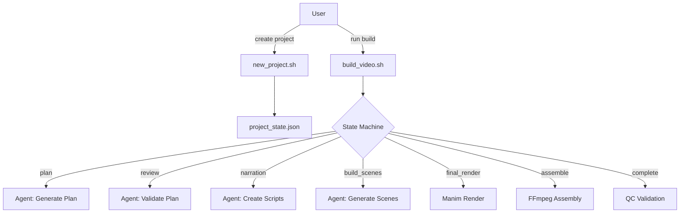

# Comprehensive Repository Analysis: Flaming-Horse Manim Video Production System

**Date**: February 12, 2026  
**Repository**: zfifteen/flaming-horse  
**Analysis Type**: Improvement & Enhancement Assessment  
**Status**: Analysis Only - No Modifications Made

---

## Executive Summary

The **flaming-horse** repository implements an incremental, agent-driven Manim video production system with sophisticated state management, ElevenLabs voice integration, and quality control mechanisms. The system successfully automates the creation of educational videos with synchronized voiceovers through a well-defined phase-based workflow.

**Overall Assessment**: The repository demonstrates solid engineering with clear documentation and robust automation. However, there are significant opportunities for improvement across **testing**, **error handling**, **monitoring**, **developer experience**, and **scalability**.

**Recommendation Priority**:
- 🔴 **Critical** (Address immediately): Testing infrastructure, dependency management
- 🟡 **High** (Address soon): Error handling, monitoring, CI/CD
- 🟢 **Medium** (Plan for future): Performance optimization, extensibility
- 🔵 **Low** (Nice to have): UI improvements, advanced features

---

## Table of Contents

1. [Repository Overview](#1-repository-overview)
2. [Code Quality & Maintainability](#2-code-quality--maintainability)
3. [Testing & Quality Assurance](#3-testing--quality-assurance)
4. [Error Handling & Validation](#4-error-handling--validation)
5. [Documentation](#5-documentation)
6. [Security & Best Practices](#6-security--best-practices)
7. [Dependency Management](#7-dependency-management)
8. [Scalability & Performance](#8-scalability--performance)
9. [User Experience & Onboarding](#9-user-experience--onboarding)
10. [Configuration Management](#10-configuration-management)
11. [Monitoring & Observability](#11-monitoring--observability)
12. [Technical Debt](#12-technical-debt)
13. [Detailed Recommendations](#13-detailed-recommendations)
14. [Priority Matrix](#14-priority-matrix)

---

## 1. Repository Overview

### Purpose
Agentic loop system for building Manim animations iteratively with synchronized ElevenLabs voiceover through an incremental state machine.

### Key Components
- **Build System**: `build_video.sh` - 527 lines of sophisticated bash orchestration
- **State Machine**: JSON-based phase progression (plan → review → narration → build_scenes → final_render → assemble → complete)
- **Agent Integration**: OpenCode/Grok integration with comprehensive prompt engineering
- **Quality Control**: `qc_final_video.sh` - Audio/video sync validation with ffmpeg
- **Helper Scripts**: Project creation, phase reset, scaffold validation

### Architecture Strengths ✅
- Clear separation of concerns (state, logic, validation)
- Well-defined phase progression model
- Centralized voice configuration preventing inconsistencies
- Comprehensive agent prompt system (AGENTS.md - 14KB)
- Lock file management preventing concurrent builds

### Repository Statistics
- **Total Size**: 1.6MB
- **Documentation**: ~8,711 lines across all docs
- **Python Scene Files**: 77 generated scenes across projects
- **Shell Scripts**: 5 executable scripts (well-structured)
- **Projects**: 12+ example projects demonstrating various topics

---

## 2. Code Quality & Maintainability

### Strengths ✅

#### Well-Structured Shell Scripts
- Consistent error handling with `set -euo pipefail`
- Clear function naming and organization
- Proper use of local variables
- Comprehensive comments and section headers

#### Modular Design
```bash
# Clear functional separation in build_video.sh
- Lock file management (acquire_lock, release_lock)
- State management (get_phase, backup_state, validate_state)
- Validation functions (validate_scene_imports, validate_voiceover_sync)
- Phase handlers (handle_plan, handle_narration, etc.)
```

#### Python Scene Template
- Consistent structure across all generated scenes
- Python 3.13 compatibility patch included
- Safe positioning helper to prevent clipping

### Issues & Improvements 🔴🟡🟢

#### 🟡 Shellcheck Warnings
**Current State**: Multiple shellcheck warnings exist
```bash
- SC2034: Unused variables (REFERENCE_DOCS, VOICE_ID, MODEL_ID)
- SC2155: Declare and assign separately
- SC2012: Use find instead of ls
- SC2317: Unreachable commands in trap handlers
```

**Impact**: These are mostly style issues but indicate areas for cleanup

**Recommendation**:
```bash
# Instead of:
local before_files=$(ls scene_*.py 2>/dev/null | sort)

# Use:
local before_files
before_files=$(find . -maxdepth 1 -name "scene_*.py" -print0 | sort -z | tr '\0' '\n')
```

#### 🟡 Magic Numbers and Hardcoded Values
**Issues**:
- Frame dimensions hardcoded in template (10, 10*16/9, 1440, 2560)
- Safe zone bounds hardcoded (max_y=4.0, min_y=-4.0)
- Timing budget fractions scattered throughout scene code
- Quality control thresholds hardcoded (0.90 ratio, 3.0s silence)

**Recommendation**: Create configuration constants file
```python
# manim_constants.py
FRAME_CONFIG = {
    'height': 10,
    'width': 10 * 16/9,
    'pixel_height': 1440,
    'pixel_width': 2560
}

SAFE_ZONE = {
    'max_y': 4.0,
    'min_y': -4.0,
    'max_x': 7.0,
    'min_x': -7.0
}

QC_THRESHOLDS = {
    'audio_coverage_min': 0.90,
    'silence_duration_max': 3.0
}
```

#### 🟢 Code Duplication
**Identified Patterns**:
1. State file reading appears in multiple places
2. Phase validation logic duplicated
3. Similar error logging patterns across handlers

**Recommendation**: Create shared helper library
```bash
# scripts/lib/state_utils.sh
get_state_field() {
  local field="$1"
  python3 -c "import json; print(json.load(open('${STATE_FILE}'))['$field'])"
}

log_error_to_state() {
  local error_msg="$1"
  python3 <<EOF
import json
with open('${STATE_FILE}', 'r') as f:
    state = json.load(f)
state['errors'].append('${error_msg}')
with open('${STATE_FILE}', 'w') as f:
    json.dump(state, f, indent=2)
EOF
}
```

#### 🟡 Lack of Type Hints in Python Helpers
**Current**: No type hints in safe_position() or Python embedded scripts
**Recommendation**: Add type hints for better IDE support
```python
from typing import TypeVar
from manim import Mobject

T = TypeVar('T', bound=Mobject)

def safe_position(mobject: T, max_y: float = 4.0, min_y: float = -4.0) -> T:
    """
    Clamp mobject to safe vertical zone to prevent clipping.
    
    Args:
        mobject: The Manim mobject to check and adjust
        max_y: Maximum safe y-coordinate
        min_y: Minimum safe y-coordinate
    
    Returns:
        The adjusted mobject (for method chaining)
    """
    # ... implementation
```

---

## 3. Testing & Quality Assurance

### Current State 🔴

**CRITICAL FINDING**: **No automated test infrastructure exists**

- No unit tests for shell functions
- No integration tests for phase transitions
- No validation tests for generated scenes
- No regression tests for agent outputs
- Manual testing only through actual video builds

### Impact
- High risk of regressions when modifying scripts
- No confidence in refactoring
- Difficult to validate bug fixes
- Quality relies entirely on manual QA

### Recommended Test Infrastructure 🔴

#### 1. Shell Script Testing with BATS (Bash Automated Testing System)

```bash
# tests/build_video_test.bats
#!/usr/bin/env bats

setup() {
  export TEST_PROJECT_DIR="/tmp/test_project_$$"
  mkdir -p "$TEST_PROJECT_DIR"
  # Create minimal state file
  cat > "$TEST_PROJECT_DIR/project_state.json" <<EOF
{
  "project_name": "test",
  "phase": "plan",
  "created_at": "2026-01-01T00:00:00Z",
  "updated_at": "2026-01-01T00:00:00Z",
  "run_count": 0,
  "scenes": [],
  "current_scene_index": 0,
  "errors": [],
  "history": [],
  "flags": {"needs_human_review": false, "dry_run": false}
}
EOF
}

teardown() {
  rm -rf "$TEST_PROJECT_DIR"
}

@test "validate_state accepts valid state file" {
  source scripts/build_video.sh
  STATE_FILE="$TEST_PROJECT_DIR/project_state.json"
  run validate_state
  [ "$status" -eq 0 ]
}

@test "validate_state rejects missing required fields" {
  # Create invalid state
  echo '{"project_name": "test"}' > "$TEST_PROJECT_DIR/project_state.json"
  source scripts/build_video.sh
  STATE_FILE="$TEST_PROJECT_DIR/project_state.json"
  run validate_state
  [ "$status" -eq 1 ]
}

@test "get_phase returns correct phase" {
  source scripts/build_video.sh
  STATE_FILE="$TEST_PROJECT_DIR/project_state.json"
  result=$(get_phase)
  [ "$result" = "plan" ]
}

@test "increment_run_count increments correctly" {
  source scripts/build_video.sh
  STATE_FILE="$TEST_PROJECT_DIR/project_state.json"
  increment_run_count
  result=$(get_run_count)
  [ "$result" -eq 1 ]
}
```

#### 2. Python Scene Validation Tests

```python
# tests/test_scene_validation.py
import pytest
import tempfile
import os
from pathlib import Path

def test_valid_scene_imports():
    """Test that valid imports pass validation"""
    scene_content = """
from manim import *
from manim_voiceover_plus import VoiceoverScene
from manim_voiceover_plus.services.elevenlabs import ElevenLabsService
"""
    with tempfile.NamedTemporaryFile(mode='w', suffix='.py', delete=False) as f:
        f.write(scene_content)
        f.flush()
        result = os.system(f'bash -c "source scripts/build_video.sh && validate_scene_imports {f.name}"')
    os.unlink(f.name)
    assert result == 0

def test_invalid_import_hyphenated():
    """Test that hyphenated imports fail validation"""
    scene_content = """
from manim-voiceover-plus import VoiceoverScene
"""
    with tempfile.NamedTemporaryFile(mode='w', suffix='.py', delete=False) as f:
        f.write(scene_content)
        f.flush()
        result = os.system(f'bash -c "source scripts/build_video.sh && validate_scene_imports {f.name}"')
    os.unlink(f.name)
    assert result != 0

def test_hardcoded_narration_detection():
    """Test that hardcoded narration text is detected"""
    scene_content = """
with self.voiceover(text="Hardcoded narration") as tracker:
    pass
"""
    with tempfile.NamedTemporaryFile(mode='w', suffix='.py', delete=False) as f:
        f.write(scene_content)
        f.flush()
        result = os.system(f'bash -c "source scripts/build_video.sh && validate_voiceover_sync {f.name}"')
    os.unlink(f.name)
    assert result != 0
```

#### 3. Integration Tests for State Machine

```python
# tests/test_state_machine.py
import json
import tempfile
from pathlib import Path
import subprocess

def test_phase_progression():
    """Test that phases progress correctly"""
    with tempfile.TemporaryDirectory() as tmpdir:
        state_file = Path(tmpdir) / "project_state.json"
        
        # Create initial state
        state = {
            "project_name": "test",
            "phase": "plan",
            "created_at": "2026-01-01T00:00:00Z",
            "updated_at": "2026-01-01T00:00:00Z",
            "run_count": 0,
            "scenes": [],
            "current_scene_index": 0,
            "errors": [],
            "history": [],
            "flags": {"needs_human_review": False, "dry_run": False}
        }
        
        with open(state_file, 'w') as f:
            json.dump(state, f, indent=2)
        
        # Test phase reset
        result = subprocess.run(
            ['bash', 'scripts/reset_phase.sh', str(tmpdir), 'review'],
            capture_output=True,
            text=True
        )
        
        assert result.returncode == 0
        
        # Verify phase changed
        with open(state_file, 'r') as f:
            updated_state = json.load(f)
        
        assert updated_state['phase'] == 'review'
        assert len(updated_state['history']) > 0
```

#### 4. Quality Control Tests

```bash
# tests/qc_test.bats
@test "QC detects missing audio" {
  # Create video with no audio track
  ffmpeg -f lavfi -i color=c=black:s=1280x720:d=5 -f lavfi -i anullsrc -t 5 /tmp/no_audio.mp4 -y
  run bash scripts/qc_final_video.sh /tmp/no_audio.mp4 /tmp
  [ "$status" -eq 1 ]
  rm /tmp/no_audio.mp4
}

@test "QC accepts valid video" {
  # Create video with proper audio
  ffmpeg -f lavfi -i testsrc=duration=5:size=1280x720 \
         -f lavfi -i sine=frequency=1000:duration=5 \
         /tmp/valid.mp4 -y
  run bash scripts/qc_final_video.sh /tmp/valid.mp4 /tmp
  [ "$status" -eq 0 ]
  rm /tmp/valid.mp4
}
```

#### 5. Test Organization

```
tests/
├── unit/
│   ├── test_state_management.bats
│   ├── test_validation_functions.bats
│   └── test_scene_imports.py
├── integration/
│   ├── test_phase_transitions.py
│   ├── test_agent_invocation.py
│   └── test_full_workflow.bats
├── e2e/
│   └── test_complete_video_build.py
├── fixtures/
│   ├── sample_states/
│   ├── sample_scenes/
│   └── sample_videos/
└── README.md
```

#### 6. Continuous Integration Setup 🟡

**Recommendation**: Add GitHub Actions workflow

```yaml
# .github/workflows/test.yml
name: Test Suite

on: [push, pull_request]

jobs:
  shellcheck:
    runs-on: ubuntu-latest
    steps:
      - uses: actions/checkout@v3
      - name: Run ShellCheck
        run: |
          sudo apt-get install shellcheck
          shellcheck scripts/*.sh

  bats-tests:
    runs-on: ubuntu-latest
    steps:
      - uses: actions/checkout@v3
      - name: Setup BATS
        uses: mig4/setup-bats@v1
      - name: Run BATS tests
        run: bats tests/**/*.bats

  python-tests:
    runs-on: ubuntu-latest
    steps:
      - uses: actions/checkout@v3
      - uses: actions/setup-python@v4
        with:
          python-version: '3.11'
      - name: Install dependencies
        run: |
          pip install pytest manim manim-voiceover-plus
      - name: Run pytest
        run: pytest tests/
```

---

## 4. Error Handling & Validation

### Current State Analysis

#### Strengths ✅
- State validation before each iteration
- Lock file management to prevent concurrent builds
- Import validation catches common mistakes
- Voiceover sync validation detects hardcoded text
- Quality control script validates audio/video sync

#### Weaknesses 🔴🟡

##### 🔴 **Insufficient Error Context**

**Issue**: Errors are logged but lack actionable context
```bash
# Current:
state['errors'].append("Scene ${new_scene} failed import validation.")

# Better:
state['errors'].append({
  "timestamp": "2026-02-12T20:45:00Z",
  "phase": "build_scenes",
  "scene_file": "scene_04.py",
  "error_type": "import_validation",
  "message": "Scene uses 'manimvoiceoverplus' instead of 'manim_voiceover_plus'",
  "line_number": 23,
  "suggested_fix": "Replace 'import manimvoiceoverplus' with 'from manim_voiceover_plus import'"
})
```

##### 🟡 **Silent Failures in Agent Invocation**

**Issue**: Agent failures are caught but not always propagated properly
```bash
# Current in invoke_agent():
local exit_code=${PIPESTATUS[0]}
if [[ $exit_code -ne 0 ]]; then
    echo "❌ Agent invocation failed with exit code: $exit_code"
    return 1
fi
```

**Problem**: Calling function doesn't always check return value

**Recommendation**: Add explicit error propagation
```bash
handle_plan() {
  echo "📝 Planning video..."
  if ! invoke_agent "plan" "$(get_run_count)"; then
    set_phase_to_error "Agent failed during plan phase"
    return 1
  fi
}

set_phase_to_error() {
  local error_msg="$1"
  python3 <<EOF
import json
from datetime import datetime
with open('${STATE_FILE}', 'r') as f:
    state = json.load(f)
state['phase'] = 'error'
state['errors'].append({
  'timestamp': datetime.utcnow().isoformat() + 'Z',
  'message': '${error_msg}'
})
state['flags']['needs_human_review'] = True
with open('${STATE_FILE}', 'w') as f:
    json.dump(state, f, indent=2)
EOF
}
```

##### 🟡 **Missing Retry Logic**

**Issue**: Transient failures (API rate limits, network issues) cause complete build failure

**Recommendation**: Add retry with exponential backoff
```bash
retry_with_backoff() {
  local max_attempts=3
  local timeout=1
  local attempt=1
  local exit_code=0

  while [ $attempt -le $max_attempts ]; do
    if "$@"; then
      return 0
    else
      exit_code=$?
    fi

    echo "Attempt $attempt failed. Retrying in ${timeout}s..." >&2
    sleep $timeout
    attempt=$((attempt + 1))
    timeout=$((timeout * 2))
  done

  echo "Failed after $max_attempts attempts" >&2
  return $exit_code
}

# Usage:
retry_with_backoff invoke_agent "plan" "$(get_run_count)"
```

##### 🔴 **No Graceful Degradation**

**Issue**: System has binary failure modes (success or complete failure)

**Recommendation**: Implement partial success handling
```bash
# Allow continuing even if some non-critical validations fail
validate_scene_with_warnings() {
  local scene_file="$1"
  local critical_errors=0
  local warnings=0
  
  # Critical: Import validation
  if ! validate_scene_imports "$scene_file"; then
    ((critical_errors++))
  fi
  
  # Warning: Timing budget
  if ! check_timing_budget "$scene_file"; then
    ((warnings++))
    echo "⚠️ WARNING: Scene may have timing issues" | tee -a "$LOG_FILE"
  fi
  
  if [ $critical_errors -gt 0 ]; then
    return 1
  fi
  
  return 0
}
```

##### 🟡 **Insufficient Validation Coverage**

**Current validations**:
- ✅ Import syntax
- ✅ Hardcoded narration
- ✅ Audio/video sync in final video

**Missing validations** 🟡:
- ❌ Timing budget overflow (animations running longer than voiceover)
- ❌ Safe zone violations (content outside +/-4, +/-7 bounds)
- ❌ Missing narration keys in SCRIPT dictionary
- ❌ Voice configuration consistency across scenes
- ❌ Required dependencies (manim, ffmpeg, sox)
- ❌ File permissions on generated assets
- ❌ Disk space before rendering

**Recommendation**: Add comprehensive pre-flight checks
```bash
preflight_checks() {
  echo "Running pre-flight checks..."
  
  # Check required commands
  for cmd in python3 ffmpeg sox manim bc jq; do
    if ! command -v $cmd &> /dev/null; then
      echo "❌ Required command not found: $cmd"
      return 1
    fi
  done
  
  # Check disk space (need at least 5GB for video rendering)
  available_space=$(df -BG "$PROJECT_DIR" | tail -1 | awk '{print $4}' | tr -d 'G')
  if [ "$available_space" -lt 5 ]; then
    echo "❌ Insufficient disk space: ${available_space}GB (need 5GB)"
    return 1
  fi
  
  # Check API key if in final_render phase
  if [ "$(get_phase)" = "final_render" ] && [ -z "$ELEVENLABS_API_KEY" ]; then
    echo "❌ ELEVENLABS_API_KEY not set"
    return 1
  fi
  
  echo "✅ Pre-flight checks passed"
  return 0
}
```

---

## 5. Documentation

### Current State ✅🟡

#### Strengths
- **Comprehensive AGENTS.md** (14KB) - Excellent agent prompt with clear rules
- **VOICE_POLICY.md** - Crystal clear policy enforcement
- **Multiple LESSONS_LEARNED docs** - Good post-mortem analysis
- **HOW_TO_ANIMATE.md** - Extensive Manim examples
- **README.md** - Clear quick start guide

#### Areas for Improvement 🟡🟢

##### 🟡 **Missing Architecture Documentation**

**Recommendation**: Create ARCHITECTURE.md
```markdown
# Architecture Documentation

## System Overview


## Phase Transition Rules
- Plan → Review: Requires valid plan.json
- Review → Narration: Manual approval OR auto-advance if no risks
- Narration → Build: Requires narration_script.py and voice_config.py
...
```

##### 🟡 **No Troubleshooting Guide**

**Recommendation**: Create TROUBLESHOOTING.md
```markdown
# Troubleshooting Guide

## Common Issues

### "ModuleNotFoundError: No module named 'manimvoiceoverplus'"
**Cause**: Incorrect import naming in generated scene
**Fix**: 
1. Open affected scene file
2. Find lines like `import manimvoiceoverplus`
3. Replace with `from manim_voiceover_plus import`

### "Audio only 0.6x of video duration"
**Cause**: Animations running longer than voiceover
**Fix**:
1. Check animation timing in scene file
2. Ensure all animations use `tracker.duration * fraction`
3. Verify fractions sum to ≤ 1.0

### Build hangs indefinitely
**Check**:
1. Lock file exists: `ls projects/myproject/.build.lock`
2. Process is actually running: `ps aux | grep build_video`
3. Remove stale lock: `rm projects/myproject/.build.lock`
```

##### 🟢 **API Documentation**

**Recommendation**: Document the state file schema formally
```markdown
# State File Schema

## Structure
```json
{
  "project_name": "string (required)",
  "phase": "enum (required): plan|review|narration|build_scenes|final_render|assemble|complete|error",
  "created_at": "ISO8601 timestamp",
  "updated_at": "ISO8601 timestamp",
  "run_count": "integer",
  "plan_file": "string|null - path to plan.json",
  "narration_file": "string|null - path to narration_script.py",
  "voice_config_file": "string|null - path to voice_config.py",
  "scenes": [
    {
      "id": "string (required) - unique scene identifier",
      "title": "string - human-readable title",
      "file": "string - Python filename",
      "class_name": "string - Python class name",
      "status": "enum: pending|built|rendered",
      "video_file": "string|null - path to rendered mp4"
    }
  ],
  "current_scene_index": "integer - index into scenes array",
  "errors": ["array of error messages or objects"],
  "history": ["array of history entries with timestamp, phase, message"],
  "flags": {
    "needs_human_review": "boolean",
    "dry_run": "boolean",
    "force_replan": "boolean"
  }
}
```

## Phase Requirements

### Phase: plan
**Inputs**: Project name, topic
**Outputs**: plan.json
**Next**: review

### Phase: review
**Inputs**: plan.json
**Outputs**: Validation result, optional flag for human review
**Next**: narration OR error (if critical issues)
...
```

##### 🟡 **No CONTRIBUTING.md**

**Recommendation**: Add contribution guidelines
```markdown
# Contributing to Flaming-Horse

## Development Setup
```bash
git clone https://github.com/zfifteen/flaming-horse.git
cd flaming-horse

# Install dependencies
pip install manim manim-voiceover-plus pytest
brew install sox ffmpeg shellcheck

# Set up environment
export ELEVENLABS_API_KEY="your_key"

# Run tests
bats tests/**/*.bats
pytest tests/
```

## Making Changes
1. Create feature branch from main
2. Make minimal, focused changes
3. Add tests for new functionality
4. Run shellcheck on modified scripts
5. Update documentation if needed
6. Submit PR with clear description

## Code Standards
- Shell scripts: Follow existing patterns, use shellcheck
- Python: PEP 8, type hints preferred
- Documentation: Update relevant docs with changes
```

---

## 6. Security & Best Practices

### Current Security Posture 🟡

#### Strengths ✅
- API keys stored in environment variables (not in code)
- File locking prevents race conditions
- Input validation on phase names

#### Security Concerns 🟡🔴

##### 🔴 **Secrets in Logs**

**Issue**: API keys might leak into log files
```bash
# build_video.sh uses tee -a "$LOG_FILE" everywhere
# If agent outputs debug info, could expose keys
```

**Recommendation**: Sanitize logs
```bash
log_safely() {
  local message="$1"
  # Redact anything that looks like an API key
  echo "$message" | sed 's/sk-[a-zA-Z0-9_-]*/REDACTED_API_KEY/g' | tee -a "$LOG_FILE"
}
```

##### 🟡 **Command Injection Risk in State File**

**Issue**: State file values used in shell commands without escaping
```bash
# Potentially dangerous if project_name contains shell metacharacters
echo "Project: $PROJECT_DIR"
```

**Recommendation**: Always quote variables and validate inputs
```bash
# Validate project name
if [[ ! "$PROJECT_NAME" =~ ^[a-zA-Z0-9_-]+$ ]]; then
  echo "❌ Invalid project name. Use only alphanumeric, underscore, hyphen."
  exit 1
fi
```

##### 🟡 **Arbitrary Code Execution via Agent**

**Issue**: Agent generates Python code that's directly executed
**Risk**: If agent is compromised or manipulated, could generate malicious code

**Mitigation Strategies**:
1. **Sandboxing**: Run Manim renders in isolated environment
```bash
# Use docker or firejail
firejail --noprofile --net=none -- manim render scene.py
```

2. **Code Review Step**: Add mandatory review before execution
```bash
review_generated_code() {
  local scene_file="$1"
  
  # Check for dangerous patterns
  if grep -qE "import os|subprocess|eval|exec|__import__" "$scene_file"; then
    echo "⚠️  WARNING: Scene contains potentially dangerous imports"
    echo "Manual review required before continuing."
    set_flag "needs_human_review" true
    return 1
  fi
}
```

3. **Static Analysis**: Use bandit for Python security scanning
```bash
pip install bandit
bandit -r "$scene_file"
```

##### 🟡 **File Permission Issues**

**Issue**: Generated files might have overly permissive permissions
**Recommendation**: Set appropriate umask
```bash
# At top of build_video.sh
umask 0077  # Create files with 600 permissions
```

##### 🟢 **Dependency Confusion**

**Issue**: No verification of package integrity for pip installs
**Recommendation**: Use requirements.txt with hashes
```txt
# requirements.txt
manim==0.17.3 --hash=sha256:abc123...
manim-voiceover-plus==0.3.0 --hash=sha256:def456...
```

```bash
pip install --require-hashes -r requirements.txt
```

---

## 7. Dependency Management

### Current State 🔴

**CRITICAL**: No formal dependency tracking

#### Issues

##### 🔴 **No requirements.txt or pyproject.toml**

**Impact**:
- Unclear which Python packages are needed
- No version pinning (reproducibility issues)
- Difficult to set up development environment

**Recommendation**: Create requirements files
```txt
# requirements.txt - Production dependencies
manim==0.17.3
manim-voiceover-plus==0.3.0
elevenlabs==0.2.24
numpy>=1.24.0,<2.0.0

# requirements-dev.txt - Development dependencies
-r requirements.txt
pytest==7.4.0
pytest-cov==4.1.0
bats==1.10.0
shellcheck-py==0.9.0
```

##### 🟡 **System Dependencies Not Documented**

**Current**: README mentions brew install but incomplete
```bash
# README.md mentions:
brew install sox ffmpeg

# Missing:
# - bc (used in qc_final_video.sh)
# - jq (potentially useful)
# - python3 minimum version requirement
# - opencode CLI tool
```

**Recommendation**: Create comprehensive setup script
```bash
#!/usr/bin/env bash
# scripts/setup_environment.sh

echo "Setting up Flaming-Horse development environment..."

# Check OS
if [[ "$OSTYPE" == "darwin"* ]]; then
  # macOS
  if ! command -v brew &> /dev/null; then
    echo "Installing Homebrew..."
    /bin/bash -c "$(curl -fsSL https://raw.githubusercontent.com/Homebrew/install/HEAD/install.sh)"
  fi
  
  brew install sox ffmpeg bc jq python@3.11
elif [[ "$OSTYPE" == "linux-gnu"* ]]; then
  # Linux
  sudo apt-get update
  sudo apt-get install -y sox ffmpeg bc jq python3.11 python3-pip
else
  echo "Unsupported OS: $OSTYPE"
  exit 1
fi

# Install Python dependencies
pip3 install -r requirements.txt

# Verify installation
python3 --version
ffmpeg -version
sox --version

echo "✅ Setup complete!"
```

##### 🟡 **No Lock Files**

**Issue**: No pip lock file (requirements.lock) for exact reproducibility
**Recommendation**: Use pip-tools
```bash
pip install pip-tools

# Generate lock file
pip-compile requirements.txt --output-file=requirements.lock

# Install from lock
pip-sync requirements.lock
```

##### 🟢 **Missing Dependency Update Policy**

**Recommendation**: Document update strategy
```markdown
# DEPENDENCY_POLICY.md

## Update Schedule
- Security updates: Immediate
- Minor updates: Monthly review
- Major updates: Quarterly review with testing

## Update Process
1. Run `pip list --outdated`
2. Review changelogs for breaking changes
3. Update requirements.txt
4. Run full test suite
5. Test with sample project build
6. Commit with clear message

## Pinning Strategy
- Pin major versions for critical dependencies (manim, manim-voiceover-plus)
- Allow minor/patch updates for utilities (numpy, etc.)
```

---

## 8. Scalability & Performance

### Current Performance Characteristics

#### Observed Patterns
- Single project builds: ~2 hours from scaffold to final video
- Sequential phase execution (no parallelization)
- Sequential ElevenLabs API calls (explicitly required)
- No caching of intermediate results

### Scalability Concerns 🟡🟢

##### 🟡 **No Parallel Scene Rendering**

**Issue**: Scenes are rendered sequentially, even though they're independent
```bash
# Current: O(n) time complexity for n scenes
for scene in scenes:
  render(scene)  # Takes 5-10 minutes each
```

**Recommendation**: Parallel rendering where safe
```bash
render_scenes_parallel() {
  local max_parallel=4
  local pids=()
  
  for scene_file in scene_*.py; do
    # Wait if at max parallel limit
    while [ ${#pids[@]} -ge $max_parallel ]; do
      for i in "${!pids[@]}"; do
        if ! kill -0 "${pids[$i]}" 2>/dev/null; then
          unset 'pids[i]'
        fi
      done
      sleep 1
    done
    
    # Start render in background
    manim render "$scene_file" &
    pids+=($!)
  done
  
  # Wait for all to complete
  wait
}
```

**Caveat**: ElevenLabs API calls must remain sequential per VOICE_POLICY.md

##### 🟡 **No Caching of Voice Synthesis**

**Issue**: Re-rendering a scene re-generates voice audio even if narration unchanged

**Recommendation**: Cache voice files with content hashing
```python
import hashlib

def get_voice_cache_key(text, voice_id, model_id):
    content = f"{text}|{voice_id}|{model_id}"
    return hashlib.sha256(content.encode()).hexdigest()

def get_cached_voice_or_generate(text, voice_id, model_id):
    cache_key = get_voice_cache_key(text, voice_id, model_id)
    cache_file = f".voice_cache/{cache_key}.mp3"
    
    if os.path.exists(cache_file):
        print(f"Using cached voice: {cache_key}")
        return cache_file
    
    # Generate new
    audio = elevenlabs.generate(text, voice=voice_id, model=model_id)
    os.makedirs(".voice_cache", exist_ok=True)
    with open(cache_file, 'wb') as f:
        f.write(audio)
    
    return cache_file
```

##### 🟢 **Large Project Directory Over Time**

**Issue**: Media files accumulate, no cleanup policy
```
projects/my_video/
  media/
    videos/
      scene_01/
        1440p60/
          SceneClass.mp4  # 500MB+
          partial/ # Even more files
```

**Recommendation**: Add cleanup command
```bash
# scripts/cleanup_project.sh
#!/usr/bin/env bash
PROJECT_DIR="${1:?Usage: $0 <project_dir>}"

echo "Cleaning up intermediate files..."

# Remove partial renders
find "$PROJECT_DIR" -type d -name "partial" -exec rm -rf {} + 2>/dev/null

# Remove old QC files
rm -f "$PROJECT_DIR"/qc_*.aac

# Remove build logs older than 30 days
find "$PROJECT_DIR" -name "*.log" -mtime +30 -delete

# Show space saved
echo "Cleanup complete"
du -sh "$PROJECT_DIR"
```

##### 🟢 **No Resource Limits**

**Issue**: Manim renders can consume all system resources
**Recommendation**: Use cgroups or ulimit
```bash
# Limit memory and CPU
systemd-run --scope -p MemoryLimit=4G -p CPUQuota=80% \
  manim render scene.py
```

---

## 9. User Experience & Onboarding

### Current UX Assessment

#### Strengths ✅
- Clear quick start in README
- Example project structure provided
- Helpful error messages in most cases
- Validation script (`validate_scaffold.sh`)

#### Pain Points 🟡🟢

##### 🟡 **Steep Learning Curve**

**Issue**: Users need to understand:
- Manim animation framework
- State machine phases
- Agent prompt engineering
- ElevenLabs API
- Shell scripting for customization

**Recommendation**: Create interactive tutorial
```bash
# scripts/tutorial.sh
#!/usr/bin/env bash

echo "🎓 Flaming-Horse Tutorial"
echo "========================="
echo ""
echo "This tutorial will walk you through creating your first video."
echo ""
read -p "Press Enter to continue..."

# Step 1: Create project
echo ""
echo "Step 1: Creating a tutorial project"
echo "We'll create a simple project about 'The Pythagorean Theorem'"
./scripts/new_project.sh tutorial_pythagorean ./tutorial_projects

# Step 2: Explain state file
echo ""
echo "Step 2: Understanding the state file"
cat tutorial_projects/tutorial_pythagorean/project_state.json | jq '.'
echo ""
echo "Notice the 'phase' field. The build process moves through phases:"
echo "  plan → review → narration → build_scenes → final_render → assemble → complete"
read -p "Press Enter to continue..."

# ... continue tutorial
```

##### 🟡 **Poor Error Recovery**

**Issue**: When build fails, user must manually inspect state and fix

**Recommendation**: Add recovery suggestions
```bash
suggest_recovery() {
  local current_phase=$(get_phase)
  local error_count=$(python3 -c "import json; print(len(json.load(open('${STATE_FILE}'))['errors']))")
  
  echo ""
  echo "🔧 Recovery Suggestions:"
  echo ""
  
  case "$current_phase" in
    error)
      echo "1. Check errors in project_state.json:"
      echo "   jq '.errors' $STATE_FILE"
      echo ""
      echo "2. Fix issues and reset to appropriate phase:"
      echo "   ./scripts/reset_phase.sh $PROJECT_DIR <phase>"
      ;;
    build_scenes)
      echo "1. Check latest scene file for issues"
      echo "2. Manually fix import or timing problems"
      echo "3. Delete scene file to regenerate:"
      echo "   rm $PROJECT_DIR/scene_XX.py"
      echo "4. Re-run build"
      ;;
    final_render)
      echo "1. Verify ELEVENLABS_API_KEY is set:"
      echo "   echo \$ELEVENLABS_API_KEY"
      echo "2. Check API quota/balance"
      echo "3. Try rendering single scene manually:"
      echo "   manim render scene_01.py Scene01"
      ;;
  esac
}
```

##### 🟢 **No Progress Indicators During Long Operations**

**Issue**: User sees no feedback during 10-minute renders

**Recommendation**: Add progress tracking
```bash
render_with_progress() {
  local scene_file="$1"
  local class_name="$2"
  
  echo "🎬 Rendering $scene_file..."
  echo "This may take 5-10 minutes..."
  
  # Start render in background
  manim render "$scene_file" "$class_name" > /tmp/render_log_$$ 2>&1 &
  local pid=$!
  
  # Show spinner while rendering
  while kill -0 $pid 2>/dev/null; do
    echo -n "."
    sleep 2
  done
  echo ""
  
  # Check result
  wait $pid
  local exit_code=$?
  
  if [ $exit_code -eq 0 ]; then
    echo "✅ Render complete"
  else
    echo "❌ Render failed - check /tmp/render_log_$$"
  fi
  
  return $exit_code
}
```

##### 🟡 **Difficult to Customize Agent Behavior**

**Issue**: Modifying AGENTS.md requires understanding complex prompt engineering

**Recommendation**: Add configuration presets
```bash
# config/agent_presets.sh

PRESET_EDUCATIONAL_SLOW() {
  # Slower pacing, more explanatory text
  WORDS_PER_MINUTE=130
  AVERAGE_SCENE_LENGTH=45
  COMPLEXITY_PREFERENCE="low"
}

PRESET_FAST_SUMMARY() {
  # Quick, high-level overview
  WORDS_PER_MINUTE=180
  AVERAGE_SCENE_LENGTH=20
  COMPLEXITY_PREFERENCE="medium"
}

PRESET_TECHNICAL_DEEP_DIVE() {
  # Detailed, technical content
  WORDS_PER_MINUTE=150
  AVERAGE_SCENE_LENGTH=60
  COMPLEXITY_PREFERENCE="high"
}
```

---

## 10. Configuration Management

### Current Approach 🟡

#### Scattered Configuration
- Voice settings: `voice_config.py` (per-project)
- Frame config: Hardcoded in template
- QC thresholds: Hardcoded in `qc_final_video.sh`
- Build settings: Hardcoded in `build_video.sh`

#### Issues 🟡

##### 🟡 **No Central Configuration File**

**Recommendation**: Create `flaming_horse.config`
```bash
# flaming_horse.config
# Central configuration for Manim video production

# Build Settings
MAX_BUILD_RUNS=50
LOCK_TIMEOUT_SECONDS=3600

# Rendering
FRAME_HEIGHT=10
FRAME_WIDTH=17.78
PIXEL_HEIGHT=1440
PIXEL_WIDTH=2560
DEFAULT_FPS=60

# Voice
VOICE_ID="rBgRd5IfS6iqrGfuhlKR"
MODEL_ID="eleven_multilingual_v2"
VOICE_STABILITY=0.5
VOICE_SIMILARITY=0.75

# Quality Control
QC_AUDIO_COVERAGE_MIN=0.90
QC_SILENCE_DURATION_MAX=3.0

# Performance
PARALLEL_RENDERS_MAX=4
VOICE_CACHE_ENABLED=true
```

Load in scripts:
```bash
# At top of build_video.sh
if [ -f "./flaming_horse.config" ]; then
  source "./flaming_horse.config"
else
  echo "⚠️  No config file found, using defaults"
fi
```

##### 🟡 **Environment-Specific Settings**

**Issue**: No distinction between dev/staging/production settings

**Recommendation**: Support multiple config profiles
```bash
# config/development.config
QC_AUDIO_COVERAGE_MIN=0.70  # More lenient in dev
PARALLEL_RENDERS_MAX=2      # Less resource intensive

# config/production.config
QC_AUDIO_COVERAGE_MIN=0.90  # Strict in production
PARALLEL_RENDERS_MAX=8      # Use more resources
```

Usage:
```bash
export FLAMING_HORSE_ENV=production
./scripts/build_video.sh projects/my_video
```

---

## 11. Monitoring & Observability

### Current State 🔴

**CRITICAL GAP**: No monitoring or metrics collection

#### Missing Observability 🔴🟡

##### 🔴 **No Build Metrics**

**Cannot answer**:
- How long do builds typically take?
- Which phase fails most often?
- How much does ElevenLabs cost per video?
- What's the average scene count?

**Recommendation**: Add metrics collection
```bash
# scripts/lib/metrics.sh

log_metric() {
  local metric_name="$1"
  local metric_value="$2"
  local metric_unit="$3"
  local timestamp=$(date -u +%Y-%m-%dT%H:%M:%SZ)
  
  # Append to metrics file
  echo "${timestamp},${metric_name},${metric_value},${metric_unit}" \
    >> "${PROJECT_DIR}/build_metrics.csv"
}

# Usage in build_video.sh:
start_time=$(date +%s)
# ... do work ...
end_time=$(date +%s)
duration=$((end_time - start_time))
log_metric "phase_duration" "$duration" "seconds"
log_metric "phase_name" "$current_phase" "string"
```

##### 🟡 **No Aggregated Reporting**

**Recommendation**: Create metrics dashboard script
```bash
# scripts/generate_metrics_report.sh
#!/usr/bin/env bash

echo "📊 Flaming-Horse Metrics Report"
echo "================================"
echo ""

# Aggregate from all projects
all_metrics=$(find projects -name "build_metrics.csv")

echo "Total Builds: $(cat $all_metrics | wc -l)"
echo ""

echo "Average Phase Durations:"
for phase in plan review narration build_scenes final_render assemble; do
  avg=$(awk -F',' -v phase="$phase" \
    '$2 == "phase_duration" && $4 == phase {sum+=$3; count++} \
     END {if(count>0) print sum/count; else print "N/A"}' \
    $all_metrics)
  printf "  %-15s: %s seconds\n" "$phase" "$avg"
done

echo ""
echo "Success Rate:"
success=$(grep -h "phase.*complete" $all_metrics | wc -l)
total=$(grep -h "phase.*plan" $all_metrics | wc -l)
rate=$(echo "scale=2; $success / $total * 100" | bc)
echo "  $rate% ($success/$total builds completed)"
```

##### 🟡 **No Alerting**

**Recommendation**: Add alert hooks
```bash
send_alert() {
  local severity="$1"  # info, warning, error
  local message="$2"
  
  case "$severity" in
    error)
      # Send to Slack/Discord/Email
      if [ -n "$SLACK_WEBHOOK_URL" ]; then
        curl -X POST "$SLACK_WEBHOOK_URL" \
          -H 'Content-Type: application/json' \
          -d "{\"text\": \"🔴 ERROR: $message\"}"
      fi
      ;;
    warning)
      echo "⚠️  WARNING: $message" | tee -a "$LOG_FILE"
      ;;
    info)
      echo "ℹ️  INFO: $message" | tee -a "$LOG_FILE"
      ;;
  esac
}

# Usage:
if [ $critical_errors -gt 0 ]; then
  send_alert "error" "Build failed in $current_phase phase for project $PROJECT_NAME"
fi
```

---

## 12. Technical Debt

### Identified Debt Items

#### 🔴 High-Priority Debt

1. **No Test Infrastructure** (Effort: High, Impact: High)
   - Estimated 40 hours to create comprehensive test suite
   - Blocks confident refactoring

2. **Hardcoded Configuration** (Effort: Medium, Impact: Medium)
   - Estimated 8 hours to centralize and document
   - Reduces maintainability

3. **Missing Dependency Management** (Effort: Low, Impact: High)
   - Estimated 4 hours to create requirements files
   - Causes setup friction

#### 🟡 Medium-Priority Debt

4. **Shellcheck Violations** (Effort: Low, Impact: Low)
   - Estimated 4 hours to fix all warnings
   - Improves code quality

5. **Code Duplication** (Effort: Medium, Impact: Medium)
   - Estimated 8 hours to extract shared functions
   - Reduces maintenance burden

6. **Limited Error Context** (Effort: Medium, Impact: Medium)
   - Estimated 12 hours to enhance error reporting
   - Improves debuggability

#### 🟢 Low-Priority Debt

7. **Missing Type Hints** (Effort: Low, Impact: Low)
   - Estimated 2 hours
   - Better IDE support

8. **No Metrics Collection** (Effort: Medium, Impact: Low)
   - Estimated 8 hours
   - Better visibility

### Technical Debt Burn-Down Plan

**Sprint 1** (Focus: Quality & Reliability)
- [ ] Create basic test infrastructure (BATS + pytest)
- [ ] Add requirements.txt and dependency docs
- [ ] Fix shellcheck violations

**Sprint 2** (Focus: Robustness)
- [ ] Enhance error handling with context
- [ ] Add retry logic for transient failures
- [ ] Implement centralized configuration

**Sprint 3** (Focus: Operations)
- [ ] Add metrics collection
- [ ] Create monitoring dashboard
- [ ] Add alerting hooks

**Sprint 4** (Focus: Optimization)
- [ ] Implement parallel scene rendering
- [ ] Add voice synthesis caching
- [ ] Optimize resource usage

---

## 13. Detailed Recommendations

### Immediate Actions (Next 2 Weeks) 🔴

1. **Create Test Infrastructure**
   - Set up BATS for shell script testing
   - Add pytest for Python validation
   - Create CI/CD pipeline with GitHub Actions
   - **Priority**: Critical
   - **Effort**: 40 hours
   - **Impact**: Enables confident development

2. **Add Dependency Management**
   - Create requirements.txt with pinned versions
   - Document system dependencies
   - Create setup script
   - **Priority**: Critical
   - **Effort**: 4 hours
   - **Impact**: Improves onboarding

3. **Enhance Error Handling**
   - Add structured error logging
   - Implement retry logic
   - Add recovery suggestions
   - **Priority**: High
   - **Effort**: 12 hours
   - **Impact**: Better reliability

### Short-Term (Next Month) 🟡

4. **Centralize Configuration**
   - Create flaming_horse.config
   - Support environment-specific configs
   - Document all settings
   - **Priority**: High
   - **Effort**: 8 hours
   - **Impact**: Easier customization

5. **Add Monitoring**
   - Implement metrics collection
   - Create reporting dashboard
   - Add alerting capability
   - **Priority**: Medium
   - **Effort**: 16 hours
   - **Impact**: Better visibility

6. **Improve Documentation**
   - Add ARCHITECTURE.md
   - Create TROUBLESHOOTING.md
   - Add CONTRIBUTING.md
   - **Priority**: Medium
   - **Effort**: 12 hours
   - **Impact**: Better onboarding

### Medium-Term (Next Quarter) 🟢

7. **Optimize Performance**
   - Implement parallel scene rendering
   - Add voice synthesis caching
   - Create cleanup utilities
   - **Priority**: Medium
   - **Effort**: 24 hours
   - **Impact**: Faster builds

8. **Enhance Security**
   - Add secret sanitization in logs
   - Implement input validation
   - Add security scanning
   - **Priority**: Medium
   - **Effort**: 16 hours
   - **Impact**: Reduced risk

9. **Improve UX**
   - Create interactive tutorial
   - Add progress indicators
   - Create configuration presets
   - **Priority**: Low
   - **Effort**: 20 hours
   - **Impact**: Better experience

---

## 14. Priority Matrix

### Implementation Priority

```
Impact vs Effort Matrix:

High Impact, Low Effort (DO FIRST) 🔴
├─ Add requirements.txt (4h)
├─ Fix shellcheck violations (4h)
└─ Add basic error context (4h)

High Impact, High Effort (PLAN CAREFULLY) 🟡
├─ Create test infrastructure (40h)
├─ Enhance error handling (12h)
└─ Add comprehensive monitoring (16h)

Low Impact, Low Effort (QUICK WINS) 🟢
├─ Add type hints (2h)
├─ Create CONTRIBUTING.md (4h)
└─ Fix code duplication (8h)

Low Impact, High Effort (DEFER) ⚪
├─ Advanced caching mechanisms
└─ Custom monitoring dashboard
```

### Risk Priority

```
Critical Risks (Address Immediately)
├─ No test coverage → Cannot refactor safely
├─ Missing dependencies → Setup failures
└─ Weak error handling → Build failures

High Risks (Address Soon)
├─ No monitoring → Cannot detect trends
├─ Hardcoded config → Difficult to customize
└─ Secret exposure → Security incident

Medium Risks (Monitor)
├─ Performance bottlenecks → Slow builds
├─ Scalability limits → Cannot handle large projects
└─ Poor UX → Adoption friction
```

---

## Conclusion

The **flaming-horse** repository demonstrates solid engineering fundamentals with a well-architected state machine, comprehensive documentation, and thoughtful design patterns. The core system successfully automates complex video production workflows.

However, the analysis reveals **critical gaps** in testing infrastructure, dependency management, and operational observability that should be addressed to ensure long-term maintainability and reliability.

### Key Strengths
- ✅ Well-structured state machine architecture
- ✅ Comprehensive agent prompt engineering
- ✅ Robust quality control mechanisms
- ✅ Clear documentation and examples
- ✅ Strong voice policy enforcement

### Critical Improvements Needed
- 🔴 **Testing**: Create automated test suite (BATS + pytest)
- 🔴 **Dependencies**: Add requirements.txt and setup docs
- 🟡 **Error Handling**: Enhance with structured logging and retry logic
- 🟡 **Monitoring**: Add metrics collection and alerting
- 🟡 **Configuration**: Centralize settings in config files

### Recommended Next Steps

1. **Week 1-2**: Implement test infrastructure and dependency management
2. **Week 3-4**: Enhance error handling and add basic monitoring
3. **Month 2**: Centralize configuration and improve documentation
4. **Month 3**: Optimize performance and enhance security

This analysis provides a comprehensive roadmap for improving the repository while maintaining its core strengths and design philosophy.

---

**Analysis Completed**: February 12, 2026  
**Analyst**: GitHub Copilot Agent  
**Review Status**: Ready for Team Review
